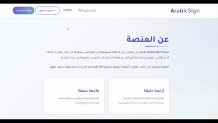
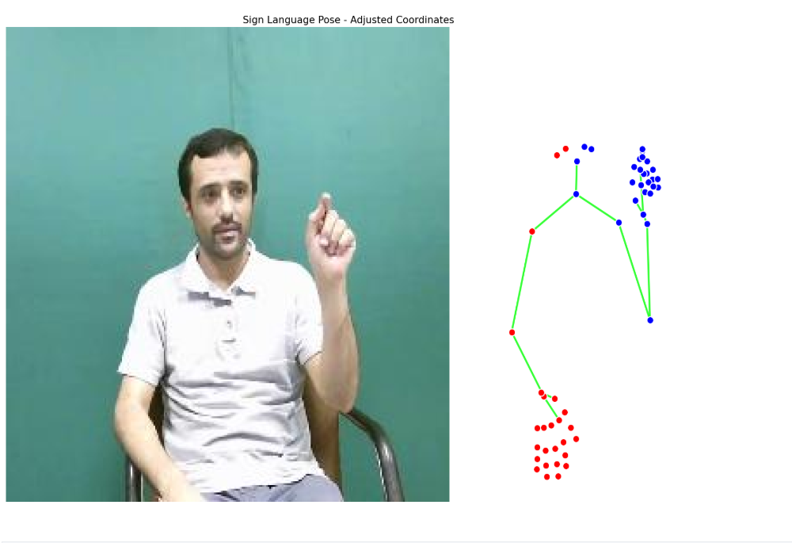
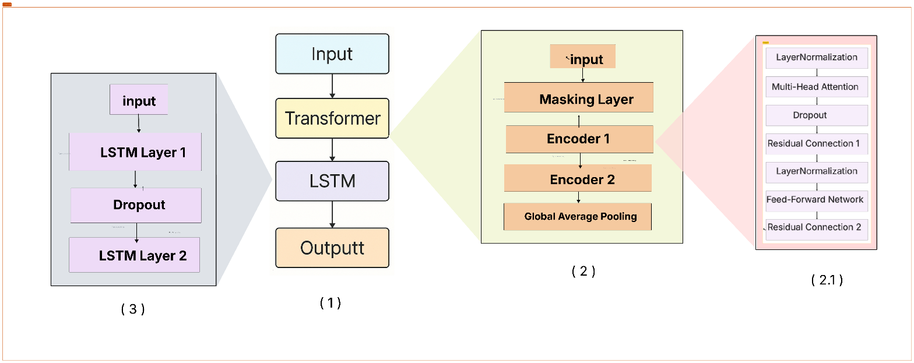
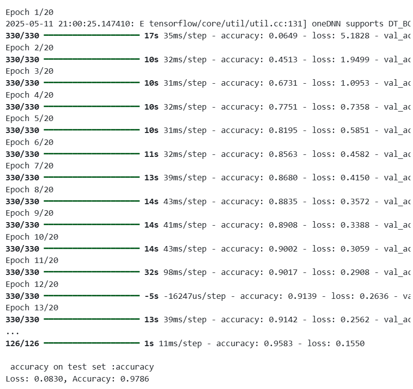
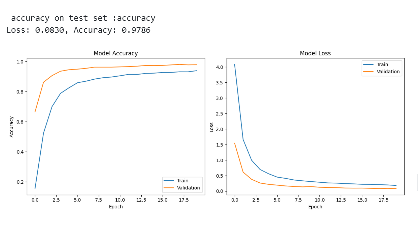

# Arabic Sign Language (ArSL) Recognition System
## An Advanced Hybrid Spatio-Temporal Recognition Model (LSTM + Transformer)


---

## 1. Project Overview

This is an advanced research and application project focused on designing and developing a high-accuracy, deep learning system for **Dynamic Arabic Sign Language (ArSL) Recognition**.

**The Core Problem:**
Sign language recognition is not a simple static image classification task. It is a complex **spatio-temporal sequence processing challenge**. The model must understand not only the *shape* of the hand (spatial features) but also *how its movement and interaction* with facial expressions and body pose evolve over *time* (temporal features).

**The Proposed Solution:**
This project implements an innovative **Hybrid Architecture** specifically engineered for this task. This architecture intelligently fuses the strengths of two distinct sequence models:
1.  **LSTMs (Long Short-Term Memory):** To understand motion flow and path-dependent sequences.
2.  **Temporal Transformers:** To understand global temporal context and long-range dependencies between frames.

This dual-branch approach enables the model to capture both path-dependent sequential patterns and global context simultaneously, leading to superior classification accuracy.

---

##  Watch The Platform in Action (Live Demo)




---

## 2. Technical Methodology & Architecture

The system is built on an end-to-end pipeline, starting from raw video input and ending with a classified sign. The training notebook `model_lstm.ipynb` documents this entire process in detail.

### 2.1. Stage 1: Feature Extraction & Engineering

Before the model can "understand" a sign, raw video data must be converted into a structured, meaningful numerical representation.


*<p align="center">Figure 1: The keypoint extraction and normalization pipeline.</p>*

1.  **Keypoint Detection:** We use **MediaPipe** to extract a comprehensive set of **108 keypoints** (X and Y coordinates) per frame, capturing hand, face, and pose landmarks.
2.  **Sequence Unification:** To ensure a fixed input size for the model, all video sequences are standardized to a length of **30 frames**. Shorter sequences are padded with zeros, and longer sequences are truncated.
3.  **Data Reshaping:** The data is transformed into a 3D tensor of shape: `(num_samples, 30, 108)`.
4.  **Intelligent Scaling:**
    * A `StandardScaler` from `scikit-learn` is used to normalize the data (zero mean, unit variance).
    * **Crucial Technical Detail:** Instead of fitting the scaler on the entire padded dataset, the data is first reshaped to `(N*30, 108)`. The scaler is then **fit *only* on the non-zero rows** (i.e., real data frames).
    * This ensures that the normalization statistics (mean and variance) are accurate and represent *only* the actual keypoint data, preventing the zero-padding from "polluting" or skewing these statistics.
    * The fitted `scaler.joblib` and `label_encoder.joblib` artifacts are saved to ensure the exact same preprocessing is applied during live inference.

### 2.2. Stage 2: The Hybrid (LSTM + Transformer) Architecture

This is the core of the project. The `hybrid_model_final_108.keras` model features a parallel two-branch architecture to analyze the spatio-temporal data.


*<p align="center">Figure 2: The `build_hybrid_model` architecture, combining Transformer and LSTM branches.</p>*

The model's input shape is `(30, 108)` (30 time steps, 108 features). A `Masking` layer is used at the start of each branch to ignore padded time steps during training.

#### Branch 1: The Temporal Transformer (Global Context)

This branch uses **Self-Attention** to weigh the importance of all frames in the sequence simultaneously. This allows it to capture complex, long-range dependencies between distant frames (e.g., relating a hand motion in frame 1 to a facial expression in frame 20).

* `Input (30, 108)`
* `Masking (mask_value=-10.0)` *(Note: A custom mask value is used per the notebook)*
* `TransformerEncoder(head_size=96)`
* `TransformerEncoder(head_size=48)`
* `GlobalAveragePooling1D()` -> Output: `(Batch, 108)`

#### Branch 2: The Stacked LSTM (Sequential Flow)

This branch processes the data sequentially, frame by frame. This makes it ideal for capturing "motion flow" and path-dependent patterns, where the current state is highly dependent on the previous states.

* `Input (30, 108)`
* `Masking (mask_value=-10.0)`
* `LSTM(64, return_sequences=True)` (Returns the full sequence to the next layer)
* `Dropout(0.3)` (For regularization)
* `LSTM(32)` (Returns only the final hidden state) -> Output: `(Batch, 32)`

#### Head: Fusion and Classification

The features extracted from both branches are combined and passed to a final classifier.

1.  **Concatenate:** The Transformer output `(108,)` and the LSTM output `(32,)` are merged to create a single, rich feature vector of shape `(140,)`.
2.  **MLP:** This combined vector is fed into a `Dense(128, activation='gelu')` layer to find high-level patterns in the fused features.
3.  **Regularization:** A final `Dropout(0.5)` layer (a high rate) is applied to robustly prevent overfitting.
4.  **Output:** A `Dense(num_classes, activation='softmax')` layer produces the final probability distribution for each sign class.

---

## 3. Training and Evaluation

The model was trained using a specific strategy to ensure robustness and handle data challenges.

### 3.1. Training Strategy

* **Loss Function:** `sparse_categorical_crossentropy`, used because the labels (`y_train`) are provided as integers, not one-hot vectors.
* **Optimizer:** `Adam` with a learning rate of `1e-3`.
* **Batch Size:** 64
* **Epochs:** 20
* **Handling Class Imbalance:**
    * The dataset is imbalanced (some signs have many more samples than others).
    * To address this, `class_weight` was computed using `sklearn.utils.class_weight.compute_class_weight` with `class_weight='balanced'`.
    * **Soft Attenuation:** An "attenuation factor" of `0.3` was applied (`weights ** 0.3`).
        * **Why?** Using raw balanced weights can be too harsh, causing the model to over-correct for minority classes and harming generalization. Applying a soft attenuation (approx. a cube root) "softens" these weights, giving a boost to minority classes without overly penalizing majority classes.

### 3.2. Performance

The model's performance was tracked by monitoring accuracy and loss on both the training and validation (test) sets.

| Training & Validation Curves | Final Performance Metrics |
| :---: | :---: |
|  |  |
| *<p align="center"><b>Figure 3:</b> The curves show <b>Stable Convergence</b>. The training and validation lines are closely aligned, indicating the model is learning effectively without significant <b>Overfitting</b>.</p>* | *<p align="center"><b>Figure 4:</b> A summary of classification metrics on the held-out test set, validating the model's high effectiveness on unseen data.</p>* |

### 3.3. Practical Validation & Deployment

The trained model is deployed in an interactive web interface (HTML/CSS/SASS) for real-time inference, proving its practical usability.

| Web Application Interface | Live Prediction Example |
| :---: | :---: |
|  
| *<p align="center"><b>Figure 5:</b> The application's user interface.</p>* | *<p align="center"><b>Figure 6:</b> A successful real-time prediction, confirming the model's ability to generalize to live, unseen data.</p>* |

---

## 4. Repository Structure

The project is organized for clarity and reproducibility.

```

arabic\_sign\_deeplearning/
├── arabic\_sign\_deeplearning/
│   ├── models/
│   │   └── hybird\_v3\_toptransfprm/
│   │       ├── hybrid\_model\_final\_108.keras \# 1. The Trained Hybrid Model
│   │       ├── label\_encoder.joblib         \# 2. The Label Encoder artifact (number -\> sign name)
│   │       └── scaler.joblib                \# 3. The Data Scaler artifact (for new inputs)
│   ├── web/                           \# 4. Frontend Web Application Files
│   │   ├── index.html  
│   │   └── style.scss  
│   └── (Python service files)         \# 5. Backend Service Files (e.g., main\_app.py)
├── notebooks/
│   └── model\_lstm.ipynb               \# 6. Full Training & Analysis Source Code
├── (Figure Assets)
│   ├── acc.png, train.png, pipe.png, ...
└── README.md

````

---

## 5. Getting Started Guide

Follow these steps to set up the environment and run the project locally.

### 5.1. Prerequisites

* [Python 3.9](https://www.python.org/) or newer.
* [Conda (Miniconda)](https://docs.conda.io/en/latest/miniconda.html) (Highly recommended for environment management).

### 5.2. Environment Setup

1.  **Clone the repository:**
    ```bash
    git clone [https://github.com/Shatha3344/arabic_sign_deeplearning.git](https://github.com/Shatha3344/arabic_sign_deeplearning.git)
    cd arabic_sign_deeplearning
    ```

2.  **Create and activate a Conda environment:**
    ```bash
    conda create -n arsl_env python=3.9 -y
    conda activate arsl_env
    ```

3.  **Install core dependencies:**
    ```bash
    # Install the deep learning framework
    pip install tensorflow

    # Install data handling and modeling libraries
    pip install scikit-learn joblib pandas numpy

    # Install the keypoint extraction library
    pip install mediapipe
    ```

### 5.3. Running the System

The system runs in two parts: the backend (model server) and the frontend (web interface).

#### A. Run the Backend Service

(This assumes you have a `main_app.py` or similar file for a Flask/FastAPI server).

1.  Navigate to the service directory:
    ```bash
    cd arabic_sign_deeplearning/
    ```
2.  Run the server (replace `main_app.py` with your actual server script name):
    ```bash
    python main_app.py
    ```

#### B. Run the Frontend Interface

1.  Navigate to the web folder:
    ```bash
    cd arabic_sign_deeplearning/web
    ```
2.  Open the `index.html` file directly in a modern web browser. The interface will connect to the backend service.

### 5.4. Retraining & Analysis

To understand the model's development or to retrain it, explore the main notebook:
* `notebooks/model_lstm.ipynb`
````
